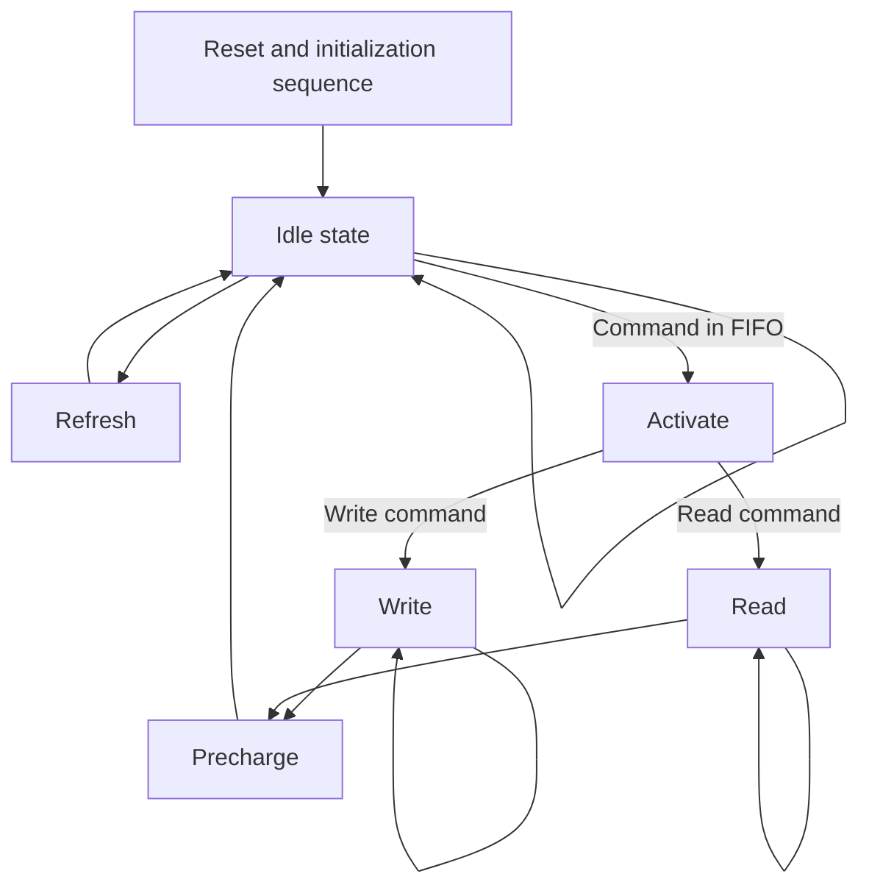

# ddr3-controller
A DDR3(L) PHY and controller, written in Verilog, for Xilinx 7-Series FPGAs.

Originally written for the Digilent Arty S7-50 development board and its supplied 2 Gbit x16 DDR3L SDRAM. It is adaptable, with parametrized timing values and bus widths. The core supports nominal frequencies of 300 MHz and up, as well as the optional "DLL disable" mode as specified by JEDEC, for operation at 125 MHz and below, for more robust operation owing to improved timing margin.

#### Features
* Read and write commands are issued into a FIFO: easy operation
* Maximized sequential read/write speeds
* Optional read calibration module using FPGA's IDELAYE2 primitives' variable taps
* Very small footprint compared to Xilinx's MIG IP
#### Quirks
* Only one open bank at a time
* No command piping or intelligent look-ahead
* Write-to-read or read-to-write commands within the same row slow sequential access
* Write leveling is not implemented
* Incomplete timing constraints 

### Usage
Externally, the core requires the user to instantiate a MMCM. Six of the MMCM outputs are to be used and wired to the core's inputs, **all generated by the same MMCM**, consisting of:
- `i_clk_ddr`: A "fast" clock at which the SDRAM is to be ran
    - `i_clk_ddr_n`: The fast clock with a 180° phase shift
    - `i_clk_ddr_90`: The fast clock with a 90° phase shift
- `i_clk_div`: A "slow" clock that is (a) in phase with i_clk_ddr, and (b) exactly 1/2 of the memory frequency
    - `i_clk_div_n`: The slow clock with a 180° phase shift
- `i_clk_ref`: A 200 MHz clock that drives the IDELAYCTRL primitive, which controls the IDELAY taps used for read calibration[^1]

[^1]: 200 MHz is the nominal frequency that you should aim for. Supported ranges, as per Xilinx documentation, are 190-210 MHz.

Also required is a FIFO module. For ease of use and peace of mind, I opted for one generated using Xilinx's FIFO generator. The size and architecture are up to the user, so long as it is a common clock FIFO with enough width to fit (1) the write address (bank + row + column width, as defined by the signals `in_phy_bank`, `in_phy_row`, and `in_phy_col`), (2) the full write word data (8 times the SDRAM width -- 128 bits for a x16 chip, or as defined by `in_phy_wrdata`), (3) the write data mask (8 bits, as defined by `i8_phy_wrdm`), and (4) one bit to signal either a read (1'b1) or a write (1'b0) command (as defined by `i_phy_cmd_sel`).[^2] The `i_phy_cmd_en` bit is wired to the FIFO "write" flag, while the `o_phy_cmd_full` is wired to the FIFO "full" flag.

 [^2]: Obviously, the write data and the write data mask bits are "do not care" if a read command is issued (command select bit is high).

#### Other signals

- `o_phy_rddata_valid` goes high for one clock cycle to indicate that the read data (8 times the SDRAM width -- 128 bits for a x16 chip, or as defined by `on_phy_rddata`) is valid.
- `i_phy_rst` is a reset signal for IDELAYCTRL, SERDES, and is wired directly to the SDRAM chip. To comply with JEDEC specifications, this signal should not be set to logic low (1'b0) until 500 us after power to the SDRAM is stable. To comply with IDELAYCTRL and SERDES specifications, the signal should be held high until all clocks are stable.
- `o_phy_init_done` goes high once the core completes the reset and initialization sequence.
- `*dqs_delay*` and `*dq_delay*` signals control the IDELAY tap values -- unless you are writing your own read calibration module, wire the `*_ce` and `*_inc` inputs to logic low. Connect the input `*_idelay_cnt` and `*_delay_ld` signals to the `rdcal` module. The output `*_idelay_cnt` signals can be ignored and are only exposed for debugging purposes.
- wire `i2_iserdes_ce` to logic high (2'b11).

### Discussion
#### Core operation
The logic part of this memory controller is relatively simple. Once the initialization is complete, the core loops and periodically requests a refresh of the SDRAM. Outside that, if the input command FIFO is not empty, the command is read out, and the proper sequence of commands is executed, e.g. ACT -> RD -> PRE for one issued read command in the command FIFO. A simplified state diagram is drawn below:

Note that there are no bank machines as in Xilinx's MIG, and only one bank may be active at a time.

Refresh requests (raised by a free running refresh timer) take precedence over user commands. User commands are run in the order that they are pushed into the command FIFO. There is no intelligent look-ahead or command re-shuffling to improve access times or data throughput.

To make use of the high burst data rate of DDR SDRAM, the core supports sequential access of one operation in the same bank and row. To this end, the read or write state is exited once either (a) the refresh timer requests an SDRAM refresh, (b) the user command is different than the previous one (e.g. previous user request was a read, current request is a write, or vice-versa), (c) the user specified bank or row are different than that of the previous read or write command, or (d) the command FIFO becomes empty.

The controller and PHY are not generic and not replaceable, as the DFI protocol is not employed.

#### FPGA area used
One of the aims of the project was to try and build a smaller alternative to Xilinx's supplied MIG IP. The same project using the Xilinx MIG DDR3 controller utilizes nearly 14% of the FPGA LUTs, versus just over 3% with this core.

For designs that prioritize low FPGA utilization ahead of high DDR3 performance, this core (once/if properly constrained) could be a possible solution.

#### The issue of Xilinx's undocumented primitives
Xilinx refuses to document or allow third parties to access the PHASER_IN and PHASER_OUT primitives beyond admitting that they exist and are used by the MIG IP in documentation. UG953, for example, includes six (!) consecutive pages, explaining that phaser elements' "only intended use is by the Memory Interface Generator (MIG), and [they are] not intended to be instantiated, used, or modified outside of Xilinx-generated IP."

This core works around the issue of the PHASER_IN primitive by instead instantiating the IDELAYE2 primitives to calibrate the read data strobe to the valid read data window, as demonstrated in the optional `rdcal` module. This method has worked well in testing.

The lack of access to the PHASER_OUT primitive is more apparent: DDR3 memory requires that the write data strobe is properly synced to the output clock. For this purpose, JEDEC has defined a new feature in DDR3 (as compared to DDR2), called write leveling. Yet, the lack of access to primitives that could delay the output signals[^3] makes write leveling impossible outside of Xilinx's own MIG.

[^3]: There exists an ODELAYE2 primitive that is well documented, but only available in HP banks. The Spartan FPGA only has HR banks.

#### Timing constraints
The lack of proper timing constraints means that the Vivado timing analysis tools cannot help in meeting the SDRAM's timing. Thus, a bitstream may not work across PVT, though it may appear to work during testing.[^4]

[^4]: In my testing of raising the operating frequency of the core beyond 300 MHz, the failure of timing would sooner be apparent in garbled writes (because of no write leveling) rather than a complete timing failure across the board. For what it's worth (read: not much -- this is anecdotal), I could not get the core to fail in any way at 125 MHz, but, again, I cannot guarantee functionality across PVT.

I haven't delved into setting up timing constraints for this projects, nor do I plan to in the near future. If you are an XDC guru and wish to contribute to this controller, feel free to contact me, open a bug, or a pull request.

#### Further reading
This core is heavily influenced by Xilinx's own XAPP721 application note, which details a similar PHY as employed here, used for DDR2 SDRAM on a Virtex-4 FPGA. Various DDR SDRAM manufacturers' application notes such as Micron's TN-04-54 ("High-Speed DRAM Controller Design") can also be of great help in regards to memory controller and PHY design.

To demistify the workings of DDR3 memory, there is of course the complete DDR3 specification in JEDEC file JESD79-3F. Also applicable here are various DDR3 SDRAM datasheets and application notes by silicon manufacturers (e.g. Micron, Samsung, SK hynix, TI, Philips, even MIT lecture notes), which act as abridged and slightly re-worded versions of the JEDEC spec. Further and more verbose instructions can be found in files that DDR SDRAM manufacturers publish alongside part datasheet, such as Micron's excellent "TN-41" series of application notes. 

For better understanding of the FPGA primitives this PHY is built from, the following Xilinx documents are invaluable (albeit not faultless) resources:
- UG471: "7 Series FPGAs SelectIO Resources"
- UG768: "Xilinx 7 Series FPGA Libraries Guide for HDL Designs"
- UG953: "Vivado Design Suite 7 Series FPGA and Zynq-7000 SoC Libraries Guide"

A similar DDR3 core focusing only on "DLL disabled" mode was written by @ultraembedded, and is available here: https://github.com/ultraembedded/core_ddr3_controller

Of course it would be remiss of me not to mention
- reddit's FPGA community at https://www.reddit.com/r/FPGA/
- Digilent's own forums at https://forum.digilent.com/
- the Xilinx support website at https://support.xilinx.com/

as treasure troves both of specific knowledge as well as general wisdoms.