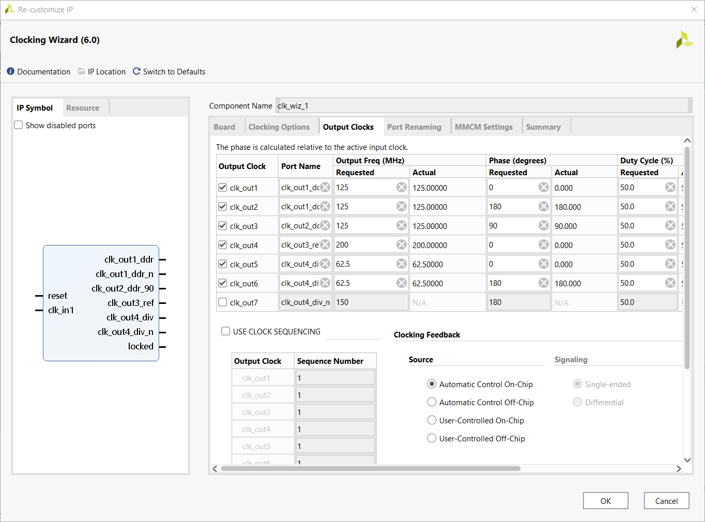
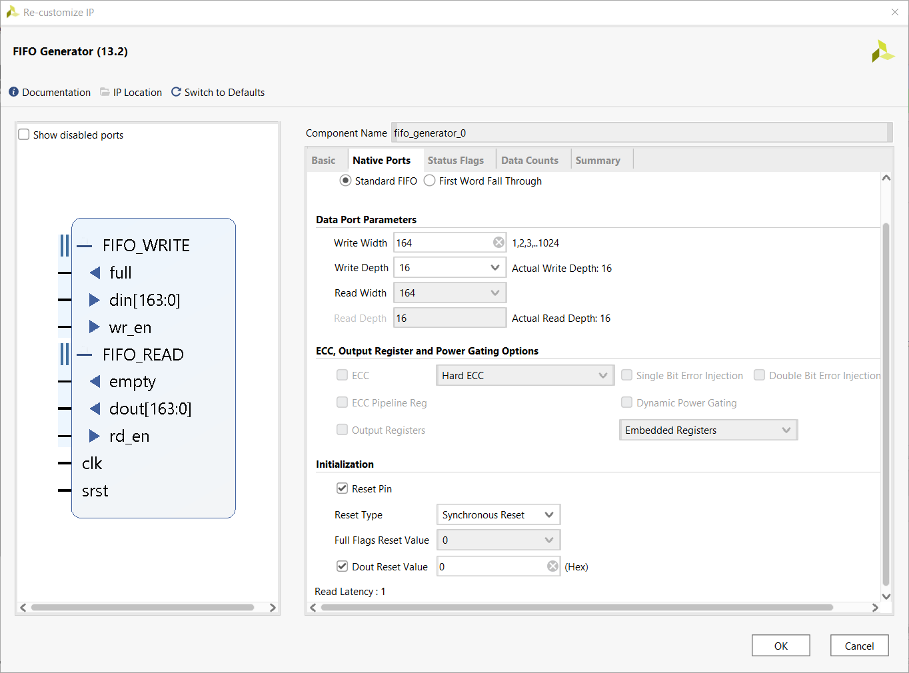
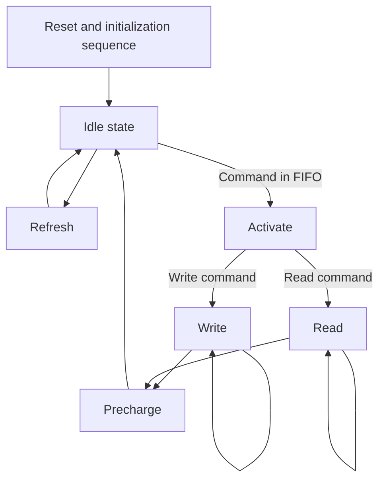
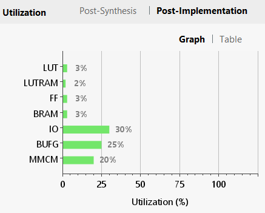

# ddr3-controller
A DDR3(L) PHY and controller, written in Verilog, for Xilinx 7-Series FPGAs.

Originally written for the Digilent Arty S7-50 development board and its supplied 2 Gbit x16 DDR3L SDRAM. It is adaptable, with parametrized timing values and bus widths. The core supports nominal frequencies of 300 MHz and up, as well as the optional "DLL disable" mode as specified by JEDEC, for operation at 125 MHz and below, for more robust operation owing to improved timing margin.

#### Features
* Read and write commands are issued into a FIFO: easy operation
* Maximized sequential read/write speeds
* Optional read calibration module using FPGA's IDELAYE2 primitives' variable taps
* Very small footprint compared to Xilinx's MIG IP
* Tested working up to 464 MHz: 40% faster than Xilinx's MIG
#### Quirks
* Only one open bank at a time
* No command re-arranging or intelligent look-ahead
* Write-to-read or read-to-write time is long even within same row
* Write leveling is not implemented: Only one SDRAM chip supported
* Incomplete timing constraints

### Usage
Externally, the core requires the user to instantiate a MMCM. Four of the MMCM outputs are to be used and wired to the core's inputs, **all generated by the same MMCM**, consisting of:
- `i_clk_ddr`: A "fast" clock at which the SDRAM is to be ran
    - `i_clk_ddr_90`: The fast clock with a 90° phase shift
- `i_clk_div`: A "slow" clock that is (a) in phase with i_clk_ddr, and (b) exactly 1/2 of the memory frequency
- `i_clk_ref`: A 200 or 300 MHz clock that drives the IDELAYCTRL primitive, which controls the IDELAY taps used for read calibration[^0]

[^0]: 200 or 300 MHz is the nominal frequency that you should aim for. Supported ranges, as per Xilinx documentation, are 190-210 MHz, and 290-300 MHz.

All of the user-facing signals (input and output) are syhcnronous to the slow `i_clk_div` clock.

Also required is a FIFO module.[^10] The FIFO needs to be wide enough to fit the controller input signals:

- `[0:0] i_phy_cmd_sel`: The command select bit (`'b1` to read, `'b0` to write)
- The read or write address, consisting of:
    - `[p_BANK_W-1:0] in_phy_bank`
    - `[p_ROW_W-1:0] in_phy_row`
    - `[p_COL_W-1:0] in_phy_col`
- `[(8*p_DQ_W)-1:0] in_phy_wrdata`: The write data[^20]
- `[7:0] in_phy_wrdm`: The write data mask[^20]

[^10]: For ease of use and peace of mind, I opted for a FIFO generated using Xilinx's FIFO generator. The depth and architecture are up to the user, so long as it is a common clock non-FWFT FIFO with sufficient depth for the application, although Xilinx's minimum depth of 16 should be good enough for any application I can think of.

 [^20]: `in_phy_wrdata` and `i8_phy_wrdm` are "do not care" if a read command is issued (i.e. `i_phy_cmd_sel` is 1'b1).

#### Other signals

- `o_phy_rddata_valid` goes high for one clock cycle to indicate that the read data (8 times the SDRAM width -- 128 bits for a x16 chip, or as defined by `on_phy_rddata`) is valid.
- `i_phy_rst` is a reset signal for IDELAYCTRL, SERDES, and is wired directly to the SDRAM chip. To comply with JEDEC specifications, this signal should not be set to logic low (1'b0) until 500 us after power to the SDRAM is stable. To comply with IDELAYCTRL and SERDES specifications, the signal should be held high until all clocks are stable.
- `o_phy_init_done` goes high once the core completes the reset and initialization sequence.
- wire `i2_iserdes_ce` to logic high (2'b11).
- `*dqs_delay*` and `*dq_delay*` signals control the IDELAY tap values -- unless you are writing your own read calibration module, wire the `*_ce` and `*_inc` inputs to logic low. Connect the input `*_idelay_cnt` and `*_delay_ld` signals to the `rdcal` module. The output `*_idelay_cnt` signals can be ignored and are only exposed for debugging purposes.

#### `rdcal` read calibration module
Nominally, in DDR3, the read strobe is synchronous to the read data. The controller is required to delay the read strobe so that data is read correctly. The read calibration module attempts to find the optimal delay for the DQ and DQS lines in order to center the read data strobe in the data valid window. The calibration is done on the entire bus simultaneously (not per-byte or per-bit). Though an improvement can be made here, I haven't encountered any failed reads due to failed calibration.

Wiring and control of the module is again made to be simple:
* The `o_phy_*` signals are to be connected from the rdcal module to the controller module:
    * `o_phy_cmd_en` --> `i_phy_cmd_en`
    * `o_phy_cmd_sel` --> `i_phy_cmd_sel`
    * `o3_phy_bank` --> `in_phy_bank`
    * etc.
* The `i_rdc_*` signals are used as the inputs of the controller's command FIFO. The controller's FIFO signals are used exclusively by the `rdcal` logic (hijacked) until the read calibration cycle is complete.
* `o_rdcal_done`: Goes high once the read calibration cycle is complete. No user commands are registered into the command FIFO while this signal is logic low.
* `o_rdcal_err`: Goes high in case that there is no combination of DQ and DQS IDELAY taps that produce valid read data.
* `i_rdcal_start`: Is used to start the calibration loop. Read calibration can be re-done at any time, but to run the calibration, 128 bits of the SDRAM's memory will be overwritten with the read calibration word.[^25]
* The `i_phy_*` signals are to be connected from the controller module to the rdcal module:
    * `o_phy_init_done` --> `i_phy_init_done`
    * `o_phy_rddata_valid` --> `i_phy_rddata_valid`
    * `on_phy_rddata` --> `in_phy_rddata`
    * etc.
* The `*delay_*` signals are to be connected from the rdcal module to the controller module:[^27]
    * `o_dq_delay_ld` --> `in_dq_delay_ld`
    * `o5_dq_idelay_cnt` --> `in_dq_idelay_cnt`
    * etc.

[^25]: By default, the read calibration word is `'h0000_FFFF_0000_FFFF_0000_FFFF_0000_FFFF`. The default address used for calibration is `27'b0`. These values can be changed by editing the `p_RDCAL_WORD` and `p_RDCAL_BANK`, `p_RDCAL_ROW`, and `p_RDCAL_COL` parameters, respectively.

[^27]: If the signal widths do not match, concatenate the signal output from the read calibration module with itself. E.g. if `in_dqs_idelay_cnt` is defined as `[9:0]`, then connect it with `{o5_dqs_idelay_cnt, o5_dqs_idelay_cnt}`.

#### Example project
An example project/top module for the Arty S7-50 board is currently available [in another repository](https://github.com/someone755/arty_s7_playground/blob/master/ddr3/ddr3.srcs/sources_1/ddr3_x16_cust_top.v).[^28] The Python script in that repository can also be used to test the functionality of the core.

[^28]: I admit the code is far from pretty, but should be good enough to see how the core and read calibration module are meant to be connected in a functional application.

### Discussion
#### Core operation
The logic part of this memory controller is relatively simple. Once the initialization is complete, the core loops and periodically requests a refresh of the SDRAM. Outside that, if the input command FIFO is not empty, the command is read out, and the proper sequence of commands is executed, e.g. ACT -> RD -> PRE for one issued read command in the command FIFO. A simplified state diagram is drawn below:

Note that there are no bank machines as in Xilinx's MIG, and only one bank may be active at a time.

Refresh requests, raised by a free running refresh timer, take precedence over user commands. User commands are run in the order that they are pushed into the command FIFO. There is no intelligent look-ahead or command re-shuffling to improve access times or data throughput.

To make use of the high burst data rate of DDR SDRAM, the core supports sequential access of one operation in the same bank and row. To this end, the read or write state is exited once either (a) the refresh timer requests an SDRAM refresh, (b) the user command is different than the previous one (e.g. previous user request was a read, current request is a write, or vice-versa), (c) the user specified bank or row are different than that of the previous read or write command, or (d) the command FIFO becomes empty.

The 2:1 ratio between the DRAM and the core clock frequencies is owed to the supported data widths of the SERDES primitives in "MEMORY" mode.[^30] Because of this, the core effectively employs a 2T command rate such that the controller's valid commands are interleaved with the "DESELECT" command.

[^30]: See UG471, Chapter 3, section "Input Serial-to-Parallel Logic Resources (ISERDESE2)", Table 3-3: Supported Data Widths. With DDR data signaling, only a 2:1 mode is supported.

The controller and PHY are not generic and not replaceable, as the DFI protocol is not employed.

#### FPGA area used
One of the aims of the project was to try and build a smaller alternative to Xilinx's supplied MIG IP. The same project using the Xilinx MIG DDR3 controller utilizes nearly 14% of the FPGA LUTs, versus just over 3% with this core.

For designs that prioritize low FPGA utilization, this core (once/if properly constrained) could be a possible solution. Testing has showed favorable results up to the limits of my Spartan 7 device at 464 MHz (928 MT/s).

#### The issue of Xilinx's undocumented primitives
Xilinx refuses to document or allow third parties to access the PHASER_IN and PHASER_OUT primitives beyond admitting that they exist and are used by the MIG IP in documentation. UG953, for example, includes six (!) consecutive pages, explaining that phaser elements' "only intended use is by the Memory Interface Generator (MIG), and [they are] not intended to be instantiated, used, or modified outside of Xilinx-generated IP."

This core works around the issue of the PHASER_IN primitive by instead instantiating the IDELAYE2 primitives to calibrate the read data strobe to the valid read data window, as demonstrated in the optional `rdcal` module. This method has worked well in testing.

The lack of access to the PHASER_OUT primitive is more apparent: DDR3 memory requires that the write data strobe is properly synced to the output clock. For this purpose, JEDEC has defined a new feature in DDR3 (as compared to DDR2), called write leveling. Yet, the lack of access to primitives that could delay the output signals[^40] makes write leveling impossible outside of Xilinx's own MIG. This fact limits the interface to single-chip DDR3 applications.[^42]

[^40]: There exists an ODELAYE2 primitive that is well documented, but only available in HP banks. The Spartan FPGA only has HR banks.

[^42]: While not ideal, note here that MIG on the Spartan 7 also does not implement write leveling and is thus limited to single-chip DDR3 applications just the same. I personally do not count this as a loss.

#### Timing constraints
The lack of proper timing constraints means that the Vivado timing analysis tools cannot help in meeting the SDRAM's timing. Thus, a bitstream may not work across PVT (process, voltage, and temperature), though it may appear to work during testing.[^50]

Routing all external signals (command, address, data bus) through OSERDES means that the IOLOGIC primitives are responsible for meeting timing. Relying on this solution has worked well in testing up to 464 MHz.

[^50]: In my testing of the core between 100 and 464 MHz, operation was flawless, but of course I cannot make guarantees about functionality across PVT. The results of my testing should be taken as anecdotal, and thorough testing should be done explored.

I haven't delved into setting up timing constraints for this project, nor do I plan to in the near future. If you are an XDC guru and wish to contribute to this controller, feel free to contact me, open a bug, or a pull request.

#### Further reading
This core is heavily influenced by Xilinx's own XAPP721 application note, which details a similar PHY as employed here, used for DDR2 SDRAM on a Virtex-4 FPGA. Various DDR SDRAM manufacturers' application notes such as Micron's TN-04-54 ("High-Speed DRAM Controller Design") can also be of great help in regards to memory controller and PHY design.

To demistify the workings of DDR3 memory, there is of course the complete DDR3 specification in JEDEC file JESD79-3F. Also applicable here are various DDR3 SDRAM datasheets and application notes by silicon manufacturers (e.g. Micron, Samsung, SK hynix, TI, Philips, even MIT lecture notes), which act as abridged and slightly re-worded versions of the JEDEC spec. Further and more verbose instructions can be found in files that DDR SDRAM manufacturers publish alongside part datasheets, such as Micron's excellent "TN-41" series of application notes. 

For better understanding of the FPGA primitives this PHY is built from, the following Xilinx documents are invaluable (albeit not faultless) resources:
- UG471: "7 Series FPGAs SelectIO Resources"
- UG768: "Xilinx 7 Series FPGA Libraries Guide for HDL Designs"
- UG953: "Vivado Design Suite 7 Series FPGA and Zynq-7000 SoC Libraries Guide"

A similar DDR3 core focusing only on "DLL disabled" mode was written by @ultraembedded, and is available here: https://github.com/ultraembedded/core_ddr3_controller

Of course I would be remiss if I didn't mention
- reddit's FPGA community at https://www.reddit.com/r/FPGA/
- Digilent's own forums at https://forum.digilent.com/
- the Xilinx support website at https://support.xilinx.com/

as treasure troves both of specific knowledge as well as general wisdoms.
